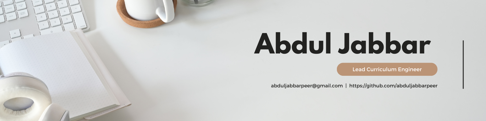
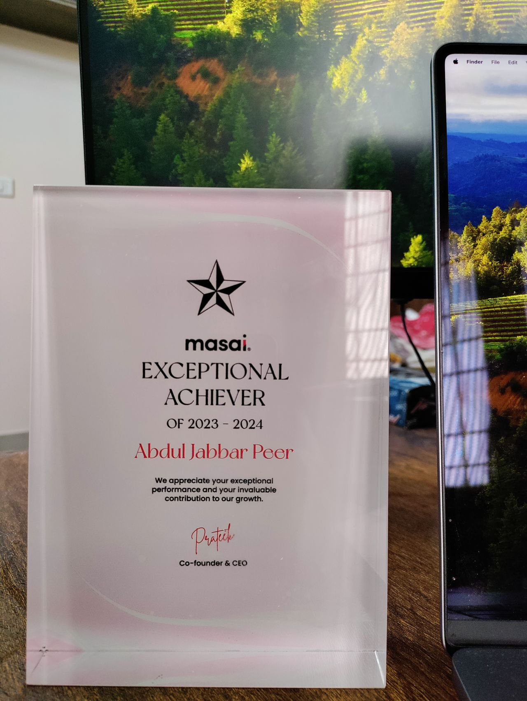
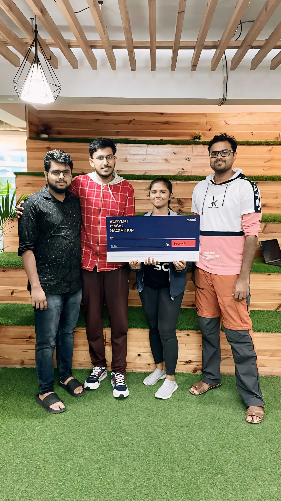

# Hi, I'm Abdul Jabbar Peer

**Ed-Tech Professional | Engineer | Problem Solver | Dedicated Husband & Father**

## 👨‍🏫 About Me

I am a Curriculum Engineer focused on bridging the gap between technology and education. My hybrid role involves designing and delivering web development curricula while also working on product development. With a background in Aeronautical Engineering and a passion for teaching, I transitioned to software development and discovered my calling in ed-tech.

In addition to my primary responsibilities, I am a problem solver in ed-tech, addressing both technical and non-technical issues. I offer a unique perspective on product ideation, drawing from my experiences as both a student and instructor. This insight, gained from transitioning from student to full-time employee, aids in designing user-centric products. I also collaborate with marketing for promotions and with B2B teams to address technical and curriculum-related challenges, supporting student placements in our outcome-based ed-tech startup.

Empathy and clear communication enable me to simplify complex topics for diverse audiences. I am dedicated to fostering a community of continuous learners, solving educational challenges through technology, and making learning accessible and meaningful for everyone.

## 👨‍💻 Work Experience

### Curriculum Engineer ➡️ Lead Curriculum Engineer @ Masai

**Jan 2021 - Present**

- Designed and delivered industry-standard web development curriculum, ensuring graduates are immediately hireable.
- Contributed to internal product development as a web developer, enhancing our educational tools.
- Recognized as an exceptional instructor with numerous accolades, awarded Exceptional Performer of the Year 2023-2024, and runner-up in the October 2023 hackathon at Masai.
- Integrated AI technologies into the curriculum and internal products, keeping pace with technological advancements.

**Exceptional Performer Of The Year : 2023-2024**

 

**Runner Up Masai Reinvent Hackathon : Oct 2023**

 

### Technical Mentor

**July 2020 - Dec 2020**

- Assisted aspiring developers by resolving their doubts on various topics and conducting 1-on-1 sessions to explain complex concepts. Identified their knowledge gaps and implemented effective solutions to bridge them. Ensured students had the best learning experience and a smooth educational journey.
- Collaborated with coding instructors to design curriculum lectures, assignments, and evaluations.

## 👨‍🎓 Education

### Full Stack Web Development Program - Masai, Bengaluru, KA, India

**Oct 2019 - Apr 2020**

Completed an intensive Full Stack Web Development program. Gained proficiency in HTML, CSS, JavaScript, React, Node.js, and MongoDB. Developed multiple projects during my time as student here.

### Bachelor's Degree in Aeronautical Engineering - PVPSIT, Vijayawada, AP, India

**Jul 2011 - Apr 2015**

Aeronautical Engineering is the branch of engineering that deals with the design, development, testing, and production of aircraft and related systems.
 
 
PVP Siddhartha Institute of Technology, established in 1998, in Vijayawada, Andhra Pradesh, is approved by AICTE and permanently affiliated to JNTU, Kakinada.

## 🤝 Let's Connect

- **[LinkedIn](https://www.linkedin.com/in/abduljabbarpeer/)**
- **Email:** abduljabbarpeer@gmail.com
